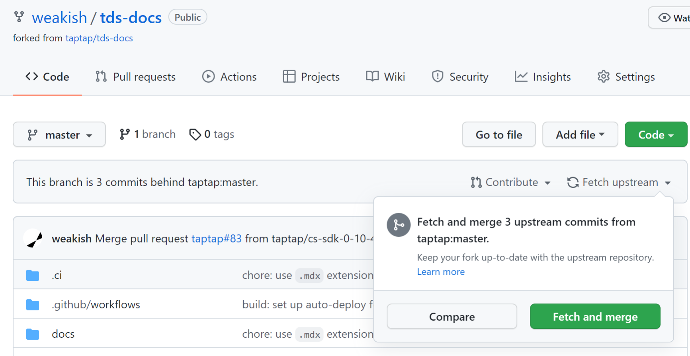
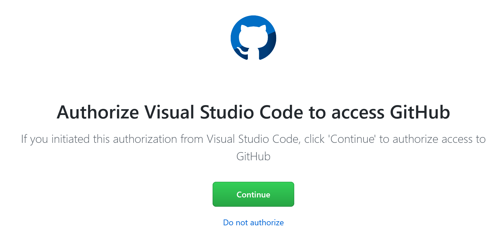
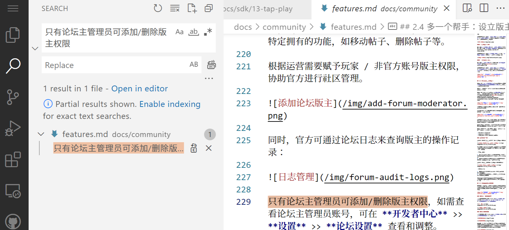
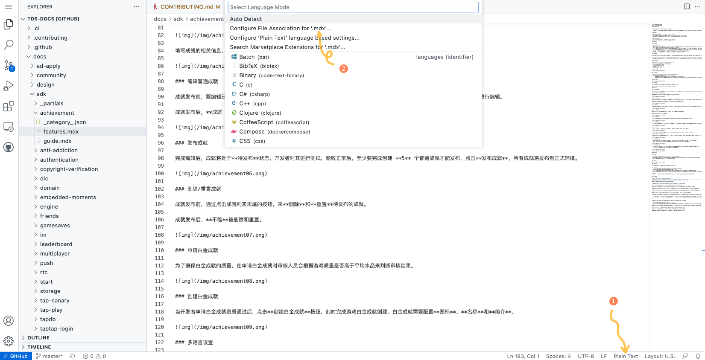
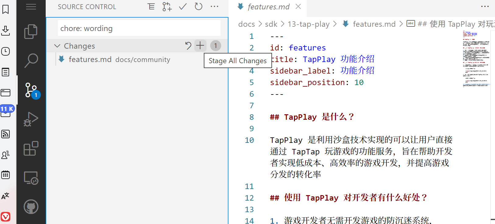
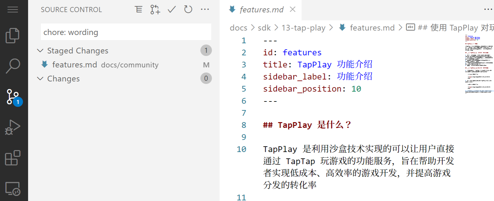
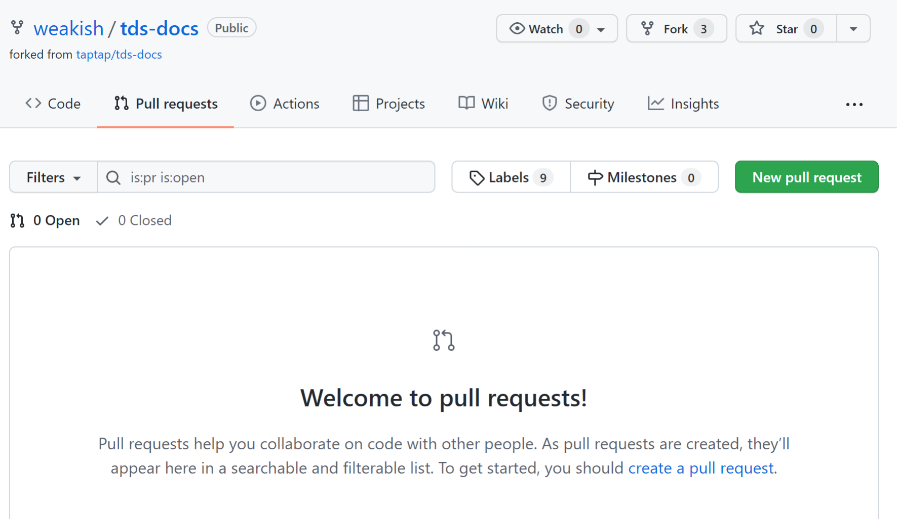
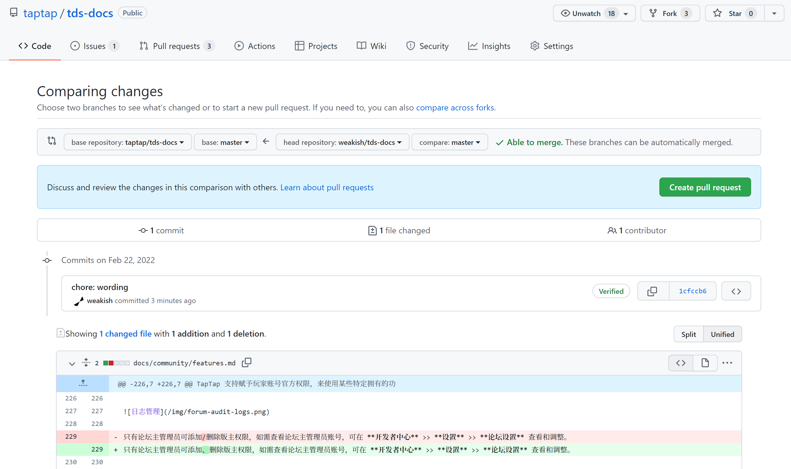
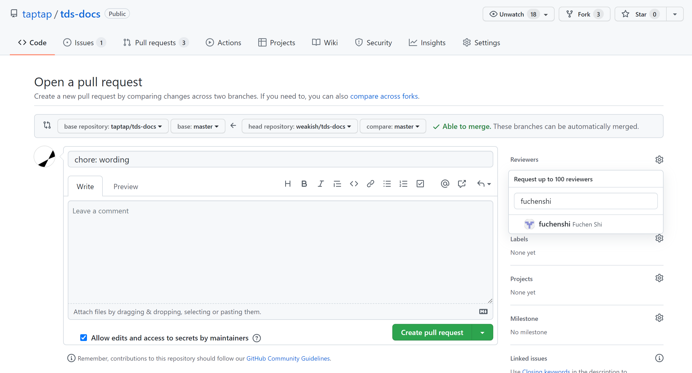
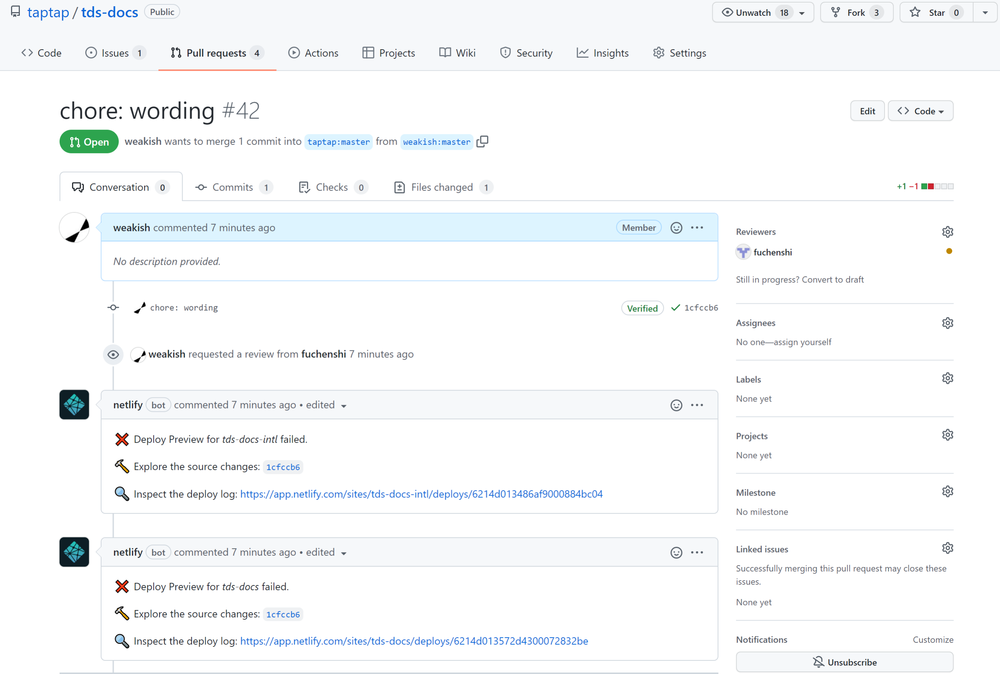

# 贡献指南

## 文案风格

请先阅读[文案风格指南][style]，确保贡献的内容符合文案风格。
其中的一些文案风格可能不符合很多人平时的行文习惯，比如：

- 直角引号
- 中文、英文、数字混合时的空格
- 「你」和「您」

敬请特别留意。

[style]: https://blog.taptap.dev/pages/chinese-copywriting-guide

## 文本格式

当前最新版本的中文文档在 `docs` 路径下，图片在 `static/img` 目录下，这是最常用到的两个目录。

完整的目录结构见 README 「目录结构」小节的说明。

文档使用 [markdown] 语法（在标准 Markdown 语法之外，还支持[一些扩展][docusaurus-markdown]）。
文章开头的 front matter 通过 [YAML] 指定一些元数据，包括标题、侧边栏标签、URL 路径等。

[markdown]: https://www.markdown-cheatsheet.com
[docusaurus-markdown]: https://docusaurus.io/docs/markdown-features
[yaml]: https://quickref.me/yaml

下面是一个例子：

```markdown
---
title: TapPlay 功能介绍
sidebar_label: 功能介绍
sidebar_position: 10
---

## TapPlay 是什么？

​TapPlay 是利用沙盒技术实现的可以让用户直接通过 TapTap 玩游戏的功能服务，旨在帮助开发者实现低成本、高效率的游戏开发，并提高游戏分发的转化率

（以下省略）
```

如果你了解 markdown 和 github 协作的一般流程，那么现在就可以开始给 TDS 文档贡献内容了。
期待你的第一个 [PR]！

[pr]: https://docs.github.com/en/get-started/quickstart/github-flow

如果你不了解这些，也没关系，可以继续阅读下面的指南。

## GitHub 在线编辑

### 编辑

刚开始向文档贡献内容，一般从编辑现有文档开始。
因此，我们先介绍编辑现有文档的流程。

在[TDS 文档的 GitHub 仓库页面][repo]点击右上角的「Fork」图标，fork 本仓库。


如果之前没有 fork 过，会 fork 一个新仓库；如果之前已经 fork 过，会提示你的 fork 的地址：


自己 fork 上的内容可能不是最新的，比如下面的截图中 GitHub 显示：

> This branch is 3 commits behind taptap:master.

意味着 fork 比主干落后 3 个提交。



点击 `Fetch upstream` 再点击 `Fetch and merge` 可同步主干上的内容。
同步后，GitHub 会显示：

> This branch is up to date with taptap:master.

**在你 fork 的仓库页面**， 按下 `.` （英文句号），即可进入 GitHub 的编辑模式。

[repo]: https://github.com/taptap/tds-docs

取决于操作系统和浏览器配置，这个快捷键也可能失效。
如果快捷键不起效，可以把浏览器地址栏的 `github.com` 换成 `github.dev`，通过这种方式同样可以进入编辑模式。

这个 GitHub 编辑模式其实是一个功能精（shòu）简（xiàn）的 vscode 编辑器，所以它的用法可以参考 [vscode 的官方文档](https://code.visualstudio.com/docs)。

初次使用时会提示授权 vscode 访问 GitHub，点击 `Continue` 进入授权页面：



授权页面会列出 GitHub for VSCode 需要的权限，点击 `Authorize github` 可以同意授权。


最左侧由上往下的图标依次是菜单、文件、查找、源码控制等功能。

要编辑现有文档，首先需要找到对应的文件。
最直观的方式是直接搜索。
比如，《学习社区模块》中的「只有论坛主管理员可添加/删除版主权限」，我们想要把 `/` 改成顿号（`、`），这样更符合中文的行文习惯。
那我们就可以直接点击最左侧的「查找」（放大镜图标），搜索这句话：



点击即可跳转到相应文件的相应位置。

注意，初次搜索会自动启用索引，会把整个仓库的索引保存在本地浏览器中。
由于 tds-docs 仓库较大，索引大小会超过默认的限制，需要点击 `Download Full Contents` 才能建立完整的索引，这样搜索时才能显示全部结果。


启用索引所以需要一些时间，请耐心等待。
索引完成后即可搜索整个仓库。

还有一种方式是根据 URL 路径来查找文件。
比如《学习社区模块》的 URL 是 `https://developer.taptap.com/docs/community/features/`.
去掉网络协议（`https://`）、域名（`developer.taptap.com`）后，URL 路径为 `/docs/community/features/`，那么对应的文件路径即为 `/docs/community/features.mdx`。

再比如，《开发者应对 DDoS 攻击问题的指引文档》的 URL 为 `https://developer.taptap.com/docs/ddos/`，所以对应的文件路径为 `/docs/ddos.mdx`。

注意，有部分不在侧边栏显示的、隐藏入口的页面的 URL 和文件路径并不对应，这种情况请通过搜索查找。
还有一些文件的命名没有遵循和 URL 路径保持一致的原则，这些属于历史遗留问题，会逐渐切换到标准的命名方式。
如果受此问题困扰，可以在文档仓库提个 issue。

### 添加图片

如果需要添加图片，点击 `img` 左侧的箭头，展开文件夹后，直接把图片拖过去即可上传，可一次性拖拽多张图片。

图片的命名请使用小写英文字母、数字、连字符（`-`），**不要包含空格**（URL 中空格需要转义，如果文件名包含空格，后续 markdown 里引用图片的时候还要转义空格，比较麻烦，而且万一忘了转义图片就无法显示。图片文件名不用空格就可以避免这些烦心事）。

图片不要和已有的图片重名，除非你想更新现有的图片。

上传图片后，在 markdown 文件中通过以下 markdown 语法引用图片：

```markdown

```

注意，和其他 markdown 标记一样，这里的符号 ![] / 都是英文半角符号。

方括号内「图片的文字描述」，用于盲人、在浏览器中选择不加载图片（网速极慢或流量极贵）等场景，因为这样的场景比较罕见，所以也可以偷懒不填。

### 预览和提交

右上角有三个图标，最左侧的图标可以分栏显示预览，可以实时预览 markdown 的渲染效果。


`.mdx` 文件如果看不到预览按钮，需要额外配置：



- 编辑器右下角点击「Plain Text」
- 选择「Configure File Association for '.mdx'」，输入 Markdown

预览仅供参考：

- 许多 docusaurus 的 markdown 语法扩展预览 GitHub 在线编辑界面都不支持。
- 个别 markdown 的渲染实现细节，docusaurus 和 GitHub 在线编辑界面存在差异。
- docusaurs 定制了 CSS 样式。


最后在 Source Control 面板看一下变动情况，没问题的话就**点击 Changes 右侧的加号，让改动进入 Staged Changes**.



最后在上面的 Message 文本框写一下 Commit Message，简单说明下做了什么改动。
大多数情况下，用一句话简短描述改动内容即可。
如有更多细节需要说明，可以空一行写详情。

```
简短描述

可选的详情
```

按 Ctrl/Command + Enter 即可提交。



提交后访问 https://github.com/YOUR-GITHUB-USERNAME/tds-docs/pulls （请替换 URL 中的用户名）



在 Pull Requests 页面点击右上方绿色的 New pull request 按钮，会显示你所做的改动。



大致看一下有没有问题，如果有问题的话，就关闭页面，重新回到 https://github.com/YOUR-GITHUB-USERNAME/tds-docs/ 按 `.` 进入编辑模式再修改。

没问题的话，点绿色的 Create pull request 按钮进入 PR 表单。
PR 标题 GitHub 会自动填写，如果不满意，可以修改一下。
右方 Reviewer 选择 weakish 或 fuchenshi 或 kylinbin 或其他相关的同事，然后再点绿色的 Create pull request 按钮提交。



如果你还不是文档仓库的协作者，那么右方 Reviewer 处有可能无法选择 reviewer。
如果你是内部贡献者，可以在 slack 上找 fuchenshi 添加为协作者；
如果你是外部贡献者，reviewer 可以留空，我们会定期 review 文档仓库的 PR.

提交后 CI 会自动构建博客预览，请稍候。
预览构建完成后，机器人 netlify bot 的回复中会出现「😎 Browse the preview: 」，点击后面的 URL 即可查看效果。
不同于 GitHub 编辑模式自动的预览，这个是真正的预览，未来发布后，线上显示的效果和预览一模一样，包括各种格式和图片。
有两条机器人回复，其中一个回复（URL 中的路径为 `tds-docs`）是 TDS 文档国内版的预览，另一个回复（URL 中的路径为 `tds-docs-intl`）是 TDS 文档国际版的预览。


上图中，「All checks have passed」标明预览构建成功。

如果查看预览的过程中发现了问题，请重新回到 https://github.com/YOUR-GITHUB-USERNAME/tds-docs/ 按 `.` 进入编辑模式再修改。
提交修改（Source Control 面板按 Ctrl/Command + Enter）后，PR 会自动更新，也会自动再次触发预览构建，请再次等待机器人 netlify bot 的回复中出现「😎 Browse the preview: 」,再次查看预览效果。

一切就绪后，等 reviewer 通过 PR 并合并，文档就正式发布到线上了。
正式发布之后，再进入编辑模式修改就不会自动更新 PR 了（因为相关 PR 已经合并了），需要开新的 PR.

如果预览构建失败，netlify 机器人的回复中会显示「❌ Deploy Preview for tds-docs-intl failed.」。



请点击 Netlify 机器人回复的「🔍 Inspect the deploy log」后的链接查看构建日志。
结合构建日志检查构建失败的原因。
常见的错误包括修改内容不符合 docusaurus 的 markdown 扩展语法，以及指向的内部页面不存在。
如认为所做修改没有问题，或者无法确定问题所在，可以在 PR 的评论中注明情况（比如怀疑可能是哪里有问题）。
内部贡献者也可以在 slack 上询问。

### 新增文档

新增文档的步骤和编辑现有文档大致相同，只不过新增文档需要先新建相应的 `.mdx` 文件。

点击「文件」图标，在左栏点击 `docs` 旁的箭头可展开文件夹，之后在鼠标悬浮到 EXPLORER 右侧的 `...` 的下方，会出现四个图标，点击最左侧的「New File」文件即可新增文件。

默认配置下，文件名会成为 URL 的一部分，因此请使用小写英文字母、数字、连字符（`-`）。
例如，在 `/docs/community/` 目录下新建 `features.mdx` 文件，那么发布后的 URL 会是 `https://developer.taptap.com/docs/community/features`。

MDX 文件开头的 [YAML] front matter 指定元信息，注意 YAML 区域上下分别用三个短横 `---` 隔开，其中用到的短横、冒号、引号都是英文半角标点。

例如：

```yaml
---
title: TapPlay 功能介绍
sidebar_label: 功能介绍
sidebar_position: 10
---
```

常用的字段包括：

- `title` 文档标题
- `sidebar_label` 侧边栏显示的短标题。`title` 一般是语义完整的、较长的标题，而 `sidebar_label` 由于侧边栏显示空间有限，需要尽可能简短。如果不指定此字段，那么侧边栏会直接显示 `title` 的值。
- `sidebar_position` 一个目录下有多个 MDX 文件时，通过 `sidebar_position` 来指定在侧边栏的顺序，数字越小越靠前。

如果是新模块，那么需要新增文件夹，Docusaurus 称之为 category。
文件使用 YAML front matter 来指定元信息，文件夹则通过文件夹内的 `_category_.json` 文件来指定元信息。

例如，成就模块对应的文件夹为 `/docs/sdk/achievement`。
相应地，`/docs/sdk/achievement/_category_.json` 的内容为：

```json
{
  "label": "成就系统",
  "collapsed": true,
  "position": 7
}
```

其中，

- `label` 为侧边栏显示的标题。
- `collapsed` 指定默认情况下是收起还是展开这一文件夹下的文档，一般都指定为 `true`。
- `position` 指定文件夹在侧边栏的顺序，数字越小越靠前。

### 添加附件

添加附件的过程和添加图片类似，把文件拖放到 `/static/files` 目录下，然后在 Markdown 文件中通过 `pathname:///files/FILENAME.EXT` 链接到文件，例如：

```markdown
点击下载 [icon.zip](pathname:///files/taptap-login-button.zip)
```

注意：

- 路径需用 `pathname:///files/xxx`，而不是 `/files/xxx`，这是为了[绕开 Docusaurus 的一个 bug][85]。
- 文件名会成为 URL 的一部分，因此请使用小写英文字母、数字、连字符（`-`）。
- 拖放文件的路径为 `/static/files`，而链接文件时不带 `static`。

[85]: https://github.com/taptap/tds-docs/pull/85

## Tips

Confluence wiki、Notion 等网页上的富文本内容，可以复制到 [Mark Text]（开源，推荐使用）、[Typora]（收费）、[StackEdit] （开源，可以在浏览器中直接使用，但对一些复杂格式的支持不如 Mark Text 和 Typora 全）可以快速转换为 markdown 代码。
注意，部分格式转换时会丢失或错误，需要手工修正。

[mark text]: https://marktext.app
[stackedit]: https://stackedit.io/app
[typora]: https://typora.io

命令行工具 [pandoc] 支持转换多种文件为 markdown，同样，部分格式转换时会丢失或错误，需要手工修正。

[pandoc]: https://pandoc.org/index.html
