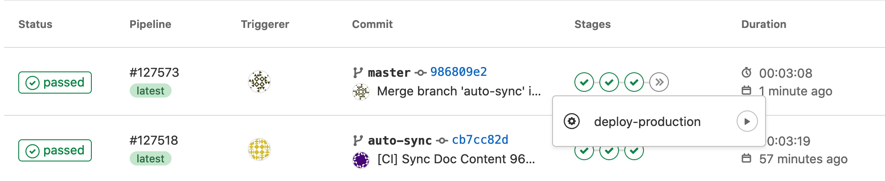

## 文档内容修改

内容方面的改动，请到 https://git.gametaptap.com/tds/client-sdk/tds-sdk-all/TapSDK-Doc-Content/ 提交。
## 文档发布注意事项

- docs 下部分中文文件名 markdown 是沿用产品提供的文档原本使用的文件名或其他迁移过来的文件名。新创建的文件请使用英文，单词之间用 `-` 连接，例如 `hello-world.md`。
- 不支持html文件脚本，直接复制markdown过来的文件可能无法初始化
- markdown跳转需要将空格换成 `-`，比如 `[<FaqLink>2. 安卓端测试形式</FaqLink>](./store-test#二、 安卓端测试形式)`
  替换成 `[<FaqLink>2. 安卓端测试形式</FaqLink>](./store-test#二、-安卓端测试形式)`
- 仔细检查sidebars.js结构，可能无法初始化左侧导航栏
- docusaurus.config.js/#themeConfig.items可以配置多个headerLinks，但是要与sidebars.js对应，否则无法初始化菜单栏
- 即便是代码块包裹的dom节点，也会无法编译，导致整个md无法加载。可以尝试用markdown转义符'\'试试
- 用不到的内容尽量删除（git 会保留历史）而不是注释掉，因为翻译人员不一定熟悉 HTML 注释标记，可能因此做无用功。
- 一定要本地运行一下，检查更改过的代码文件是否能正常打开再pr
- 若端口冲突，可手动修改package.json#start脚本；可以添加外部访问ip段，或者指定全部docusaurus start --port 3000 --host 0.0.0.0
- `master` 分支为主分支，`auto-sync` 自动同步 TapSDK-Doc-Content 的改动。其他分支均为开发使用，无特殊含义。

## 多编程语言

多种编程语言的代码示例可以使用 `MultiLang` 组件：

    <MultiLang>

    ```cs
    public static void GetAccessToken (Action<AccessToken, TapError> action);
    ```

    ```java
    public static AccessToken getCurrentToken;
    ```

    ```objectivec
    + (AccessToken *)getCurrentToken;
    ```

    </MultiLang>

注意：

- 如果文件开头没有引入 `MultiLang` 组件，那么需要引入一下：`import MultiLang from '/src/docComponents/MultiLang';`
- `<MultiLang>` 后、`</MultiLang>` 前、以及不同语言的代码片段之间都要空一行，否则 MDX 语法无法正确解析。
- 语言的顺序为 C#、Java、Objective-C，不能乱。
- 有些地方多语言代码示例使用 `Tabs` 组件，它的效果和 `MultiLang` 是等效的（实际上 `MultiLang` 最终会生成 `Tabs` 组件）。因为 `MultiLang`
  更简洁，所以新编写的多语言代码示例推荐使用 `MultiLang`。

实际上，`MultiLang` 里不仅可以放入代码片段，还可以放入其他各种组件，只需保证：1) 内容顺序为 C#、Java、Objective-C，2) 不同编程语言内容在组件层级上是同级的。 下面是一个例子：

    <MultiLang>
    <>

    ```cs
    public static void Login (LoginType loginType, string[] permissions);
    ```

    **LoginType参数说明**

    参数  | 描述
    | ------ | ------ |
    LoginType.TAPTAP | TapTap 登录

    </>
    <>

    ```java
    /**
    * @param type TapTap = 0
    */
    public static void login(Activity activity, @LoginType.ThirdPartyType int type, String... permissions);
    ``` 

    **LoginType参数说明**
    
    参数  | 描述
    | ------ | ------ |
    0 | TapTap 登录

    </>
    <>

    ```objectivec
    + (void)login:(TapBootstrapLoginType)type permissions:(NSArray *_Nullable)permissions;
    ```

    **LoginType参数说明**
    
    参数  | 描述
    | ------ | ------ |
    TapBootstrapLoginTypeTapTap | TapTap 登录

    </>
    </MultiLang>

上面的例子中，我们使用了空标签 `<>...</>` (React 的 Fragment 组件) 将 C#、Java、Objective-C 的不同内容包成三组。
同样，空标签和 markdown 之间也需要留出空行。
另外，由于 docsaurus 的 TOC 生成并不能正确处理这种情况下的小标题（仅会根据第一个标签的内容生成小标题，切换标签后 TOC 的内容不变），请不要在 `Multilang` 标签中使用 `h1`、`h2`、`h3` 级别的标题。
最后，某些文档面向的平台并不是 Unity、iOS、Android，这种情况下可以用 `kind` 参数指定使用 MultiLang 的变体，比如云引擎文档使用 `<MultiLang kind="engine">`，顺序为 JavaScript、Python、PHP、Java、C#、Go.

## 图表

支持 [Mermaid](https://mermaid-js.github.io/mermaid/#/)。

在文件开头引入 Mermaid 组件：

```js
import Mermaid from '/src/docComponents/Mermaid';
```

然后在 Mermaid 组件的 diagram 属性中写 Mermaid 语法：

```js
<Mermaid diagram={`
graph LR
A((delete))-->|beforeDelete|H{error?}
H-->Y(Yes)
Y-->Z((interrupted))
H-->N(No)
N-->B[delete object on the cloud]
B -->|afterDelete|C((done))
`} />
```

## 上传文件

视频等大文件可以上传到 LC 华北节点的 capacity-center 应用（App ID：lhzo7z96ayhad9flpynyiu79t2jpzuasz2ke8cdb09zduvug）。

0. 初次上传前，先找 jiangruoxu、suixiaoxu 加你为应用的协作者，之后即可通过 LC 控制台上传文件。
1. 登录 LC 控制台 > 数据存储 > 文件： <https://console.leancloud.cn/apps/lhzo7z96ayhad9flpynyiu79t2jpzuasz2ke8cdb09zduvug/storage/file>
2. 点击「上传」按钮上传文件，上传完成后，文件表格中的 URL 即为文件的 URL

图片等小文件请直接提交至仓库。

## SDK 版本号

SDK 版本号统一维护在 `/src/docComponents/sdkVersions.ts`。当 SDK 版本有更新时，只需在这里更新对应 SDK 的版本号，文档中所有引用这个版本号的地方就会跟着更新。

如果一篇文档需要引用 SDK 版本号，需要先在开头引入前面提到的这个文件：

```js
import sdkVersions from '/src/docComponents/sdkVersions';
```

如果版本号会出现在代码块中，还需要额外引入 `CodeBlock`：

```js
import CodeBlock from '@theme/CodeBlock';
```

根据版本号出现的位置不同，引用的方法也略有不同。如果版本号出现在一般段落中（非代码块），需要先将这部分段落用 JSX 语法改写，然后在版本号出现的地方插值：

```diff
- - 华为（HMS) 'cn.leancloud:mixpush-hms:8.1.4'
- - 小米 'cn.leancloud:mixpush-xiaomi:8.1.4'
+ <ul>
+   <li>华为（HMS) 'cn.leancloud:mixpush-hms:{sdkVersions.leancloud.java}'</li>
+   <li>小米 'cn.leancloud:mixpush-xiaomi:{sdkVersions.leancloud.java}'</li>
+ </ul>
```

如果版本号出现在代码块中，需要先将包裹代码块的 ` ``` ``` ` 用 `<CodeBlock>{``}</CodeBlock>` 替换，然后在版本号出现的地方插值。代码的语言可通过 `className` 传递给 `CodeBlock`：

```diff
- ```groovy
- dependencies {
-   //混合推送需要的包
-   implementation 'cn.leancloud:mixpush-android:8.1.4'
-   //即时通信与推送需要的包
-   implementation 'cn.leancloud:realtime-android:8.1.4'
-   implementation 'io.reactivex.rxjava2:rxandroid:2.1.0'
- 
-   implementation 'com.huawei.hms:push:4.0.2.300'
- }
- ```
+ <CodeBlock className="groovy">
+ {`dependencies {
+   //混合推送需要的包
+   implementation 'cn.leancloud:mixpush-android:${sdkVersions.leancloud.java}'
+   //即时通信与推送需要的包
+   implementation 'cn.leancloud:realtime-android:${sdkVersions.leancloud.java}'
+   implementation 'io.reactivex.rxjava2:rxandroid:2.1.0'\n
+   implementation 'com.huawei.hms:push:4.0.2.300'
+ }`}
+ </CodeBlock>
```

注意：如果代码中有空行，需要替换成 `\n` 放在前一行结尾，否则会报错。

## 优化图片

运行 `npm run optimg` 任务可以优化 `static/img` 下的 JPEG （有损压缩）和 PNG 图片（无损压缩）。
这一任务运行时间较长，所以未加入构建环节，需要手动运行。
建议过一段时间（比如一两个月）跑一下。

## 本地预览

```sh
npm start
```

注意，`npm start` 并不会检查坏链。
如需检查坏链，需要运行 `npm run build`。

## 文档发布

`auto-sync` 分支会自动发布到预览环境：https://developer.xdrnd.com/docs/

`master` 分支点第四个（最后一个） job （`deploy-production`）的按钮可以发布到线上（只有 `master` 分支可以发到线上）



## 关于国际化

> 参考 [docusaurus文档](https://v2.docusaurus.io/docs/i18n/tutorial)

- 国际化文件存放于`i18n`文件夹下，对应的目录结构如下：

    ```
    └── en
      ├── code.json  默认的翻译（自定义页面等）
      ├── docusaurus-plugin-content-docs
      │  ├── current 翻译文档的文件夹（层级相当于/doc，需要一一对应）
      │  └── current.json  文档目录Sidebar的翻译
      └── docusaurus-theme-classic
         └── navbar.json 顶栏Header的翻译
    ```

- 运行 `npm start -- --locale en` 可预览英文文档效果。

- 文档翻译使用 [memsource]，UI 文案翻译使用 [weblate]，详询 yangyuning

[memsource]: https://www.memsource.com/

[weblate]: https://translate.gametaptap.com/projects/taptap-developer/

## 多版本

按照以下流程增加一个版本：（请将 `N` 替换为具体的数值）

1. 确认当前仓库没有包含任何新版本（`N+1` 版本）的内容
2. 新建一个分支，比如 `vN`，运行 `npm run docusaurus docs:version vN`
3. 替换 `versioned_docs/version-vN/` 下的内链，替换的正则是 `\]\(/(sdk|store|design)` 替换值为 `](/vN/$1`
4. 提交 `versioned_docs`、`versioned_sidebars`、`versions.json` 等改动
5. 在 Content 仓库上新建一个分支，比如 `vN+1`，准备好 `N+1` 版本的内容
6. 合并 `vN` 至 master
7. 在 Content 仓库合并 `vN+1`，在 doc 仓库，自动同步的 auto-sync 分支 rebase master 后合并到 master
8. 通过 xdrnd 查看效果，确认没问题
9. deploy 至线上

6 - 9 需要一次性完成，开弓没有回头箭（其实是有的，但是比较麻烦），在此期间 Content 仓库处于冻结状态，不接受新的改动。
完成第 2 步后，Content 仓库最好也冻结，如果有非常必要的改动（比如 N.x 的重要错误修复），需要回滚第 4 步的提交后，将改动合并到 master，然后重新开始第 2 步。
第 9 步完成后，Content 仓库只接受针对 `N+1` 版本的改动，旧版文档一般就不修改了，如有必要修改（重要错误修复），需直接至 tapsdk-doc 仓库提交修改。


 
